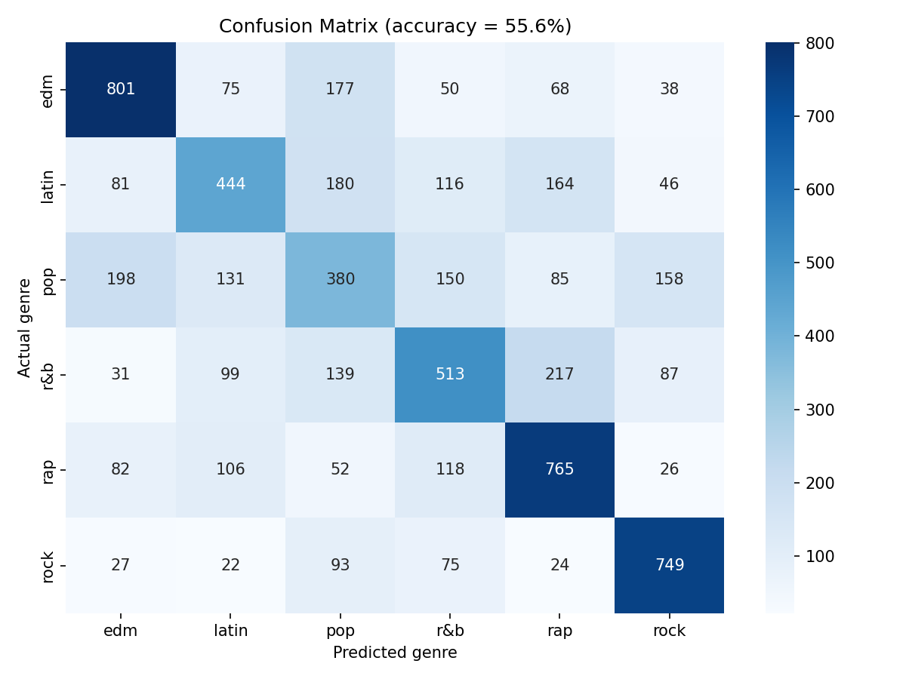
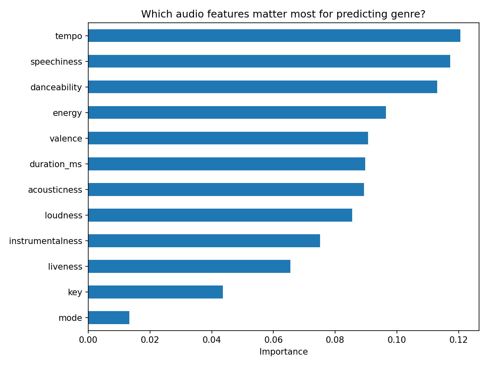

# Spotify Genre Classifier

My first proper end-to-end ML project. Can you actually predict a song's genre just from its audio characteristics (danceability, energy, tempo, that sort of thing), with zero info about the artist or title?

## The data

32,833 real Spotify tracks across 6 genres (EDM, rap, pop, R&B, latin, rock). Each track comes with 12 numeric audio features straight from Spotify's own API: danceability, energy, key, loudness, mode, speechiness, acousticness, instrumentalness, liveness, valence, tempo, duration.

## How it's put together

| File | What it does |
|---|---|
| `01_explore.py` | loads the data, checks the shape, missing values, whether genres are balanced |
| `02_visualize.py` | boxplots comparing the audio features across genres |
| `03_train_model.py` | trains the model and checks how good it actually is |

Run them in order:

```bash
pip install -r requirements.txt
python3 01_explore.py
python3 02_visualize.py
python3 03_train_model.py
```

## The model

A Random Forest classifier (basically a big group of decision trees that each vote on the answer, 200 of them here), trained on an 80/20 split, so the score below is on songs the model never saw while training.

Test accuracy: 55.6%. Doesn't sound huge on its own, but random guessing across 6 genres would only get you about 16.7%, so this is roughly 3.3x better than just guessing.



### What it's good and bad at

Best at spotting rock (72% F1, F1 is basically a combined precision and recall score, one number that punishes a model for being wrong either by missing tracks or wrongly flagging them) and EDM (66% F1). Makes sense, both have a pretty consistent audio fingerprint: rock leans lower danceability with more energy swings, EDM is just high energy in a specific tempo range.

Worst at pop, only 36% F1, mostly getting confused with R&B and latin. Honestly this tracks though. Pop isn't really its own sound, it's more of a commercial label that borrows bits from whatever genre is popular at the time, so there isn't one clean audio signature for the model to latch onto. Kind of a nice thing to have found out by accident rather than something I set out to prove.



Danceability, energy, and speechiness ended up mattering most for telling genres apart.

## What I'd try next

- Use the finer-grained `playlist_subgenre` labels instead, harder problem
- Try XGBoost or LightGBM and see if it beats the Random Forest
- Do this properly with cross-validation instead of one fixed train/test split (80/20)

## Tools used

Python, pandas, scikit-learn, matplotlib, seaborn.
